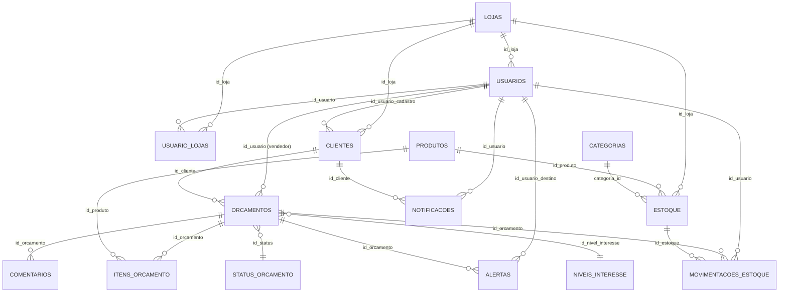

# Dicionário de Dados — CV CRM

Documentação do banco de dados (Supabase/Postgres) do CRM de vendas. Gerada por
introspecção direta do schema em produção (2026-08-18) — reflete o estado real
do banco, não apenas o que o código do front-end usa.

> Para a arquitetura do front-end (módulos `src/`), ver o [README.md](../README.md).

## Modelo de tenant

O "tenant" do sistema é a **loja** (`lojas`). Existem três perfis (`usuarios.perfil`):

| Perfil | Escopo de acesso |
|---|---|
| `Administrador` / `Admin` | Irrestrito — vê e gerencia tudo, todas as lojas |
| `Gerente` | Restrito à(s) loja(s) associada(s) — uma ou mais, via `usuario_lojas` (com fallback para `usuarios.id_loja` quando não há registro lá) |
| `Vendedor` | Restrito aos próprios registros (`id_usuario = eu mesmo`) |

Esse modelo é reforçado no banco via **Row Level Security (RLS)**, habilitado em
todas as tabelas — ver a seção [Segurança (RLS)](#segurança-rls) mais abaixo.
Não existe mais um perfil "Terminal" (removido do código e da constraint do
banco em 2026-08-18).

## Diagrama de relacionamentos

---

## Tabelas de negócio

### `orcamentos` — o coração do sistema

Cada linha é uma oportunidade de venda (um "orçamento"/negociação), do primeiro
contato até fechar ou perder. Soft delete via `deleted_at`.

| Coluna | Tipo | Notas |
|---|---|---|
| `id_orcamento` (PK) | uuid | |
| `protocolo` | text | Gerado automaticamente via sequence `protocolo_seq` — número público exibido pro usuário (ex: "#5014077") |
| `id_cliente` → `clientes.id_cliente` | uuid | |
| `id_usuario` → `usuarios.id_usuario` | uuid | O **vendedor** responsável — base de todo o isolamento por Vendedor no RLS |
| `id_status` → `status_orcamento.id_status` | uuid | Etapa do funil (Contato Inicial, Negociação, Em Fechamento, Fechado, Perdido) |
| `id_nivel_interesse` → `niveis_interesse.id_interesse` | uuid | Nível de interesse do cliente |
| `valor_orcado` | numeric | Valor total. Recalculado automaticamente pelo trigger `trg_itens_orcamento_valor` sempre que `itens_orcamento` muda — **não confiar em updates diretos** se houver itens cadastrados |
| `modelo_colchao` | text | String livre com os produtos (nomes separados por vírgula) — é como o front-end grava hoje, mesmo havendo a tabela `itens_orcamento` mais estruturada |
| `origem` | text | De onde veio o lead |
| `motivo_contato`, `tipo_entrega`, `forma_pagamento` | text | Metadados da negociação |
| `data_contato` / `hora_contato` | date / time | Próximo follow-up agendado — usado pela Agenda do Dia |
| `observacao_agendamento` | text | Texto livre sobre o agendamento |
| `data_fechamento` | timestamptz | Preenchida automaticamente pelo trigger `fn_registrar_mudanca_status` quando o status vira Fechado/Vendido |
| `motivo_perda` | text | Preenchido ao marcar como perdido. CHECK restringe a: `Preço Alto, Concorrência, Prazo de Entrega, Desistência, Falta de Limite, Outros` |
| `ligacao_confirmada` | boolean | |
| `deleted_at` | timestamptz | Soft delete (funções `fn_soft_delete_orcamento`/`fn_restore_orcamento`) |

**RLS:** Admin vê tudo · Gerente vê orçamentos cujo vendedor (`id_usuario`) pertence a uma loja permitida · Vendedor vê só os próprios (`id_usuario = eu`). INSERT sempre exige `id_usuario = eu mesmo` (não dá pra criar orçamento "em nome" de outra pessoa).

**Automação (triggers):** ver [Funções e triggers](#funções-e-triggers-automação) — fechar um orçamento dispara baixa de estoque automaticamente; reabrir/perder após fechado reverte a baixa; mudança de status vira comentário automático no histórico.

---

### `clientes`

| Coluna | Tipo | Notas |
|---|---|---|
| `id_cliente` (PK) | uuid | |
| `nome_cliente`, `whatsapp`, `cpf`, `email` | text | |
| `id_cliente_codigo` | text | Código sequencial gerado pela RPC `rpc_salvar_orcamento` (formato `CLI-000001`) |
| `id_usuario_cadastro` → `usuarios.id_usuario` | uuid | Quem cadastrou o cliente |
| `id_loja` → `lojas.id_loja` | uuid | Existe na tabela, mas **o front-end não filtra por ela** — a visibilidade de um cliente é derivada por quem tem orçamento com ele (ver RLS abaixo). Coluna possivelmente subutilizada; considerar migrar a lógica pra usar `id_loja` diretamente no futuro |
| `id_usuario` | **text** | ⚠️ Coluna legada, tipo `text` (não uuid, ao contrário de todas as outras `id_usuario` do banco). Não confundir com `id_usuario_cadastro` |
| `deleted_at` | timestamptz | Soft delete |

**RLS:** visibilidade derivada via `orcamentos` — um cliente é visível se existe algum orçamento dele cujo vendedor está no escopo de quem está consultando (Admin: todos · Gerente: vendedores da(s) loja(s) permitida(s) · Vendedor: só os próprios). Exclusão restrita a Gerente/Admin (Vendedor não pode excluir cliente, nem pela UI nem pelo banco).

---

### `usuarios`

Os "funcionários" do sistema (vendedores, gerentes, admins). **Não há FK entre
esta tabela e `auth.users`** — a vinculação entre a sessão autenticada e o
registro de usuário é feita **por e-mail** (`usuarios.email` comparado
case-insensitive com o e-mail da sessão), via a função `current_id_usuario()`.
Ver [Segurança (RLS)](#segurança-rls).

| Coluna | Tipo | Notas |
|---|---|---|
| `id_usuario` (PK) | uuid | Identidade própria da aplicação — **não é o mesmo UUID de `auth.users.id`** |
| `nome`, `email` | text | `email` pode ser `NULL` em registros legados/administrativos |
| `perfil` | text | CHECK: `Vendedor`, `Gerente`, `Administrador`, `Admin` |
| `status` | text | `Ativo` por padrão — usuários inativos não conseguem logar (checado em `checkSession`/`handleLogin` no front-end) |
| `id_loja` → `lojas.id_loja` | uuid | Loja base do usuário (fallback quando não há registro em `usuario_lojas`) |
| `meta_mensal` | numeric | Meta de vendas do vendedor, padrão R$ 50.000 |
| `deleted_at` | timestamptz | Soft delete |

Criado automaticamente quando alguém se cadastra no Supabase Auth (trigger
`cria_perfil_usuario`, `SECURITY DEFINER`, em `auth.users`) — **atenção:** se o
`raw_user_meta_data` não especificar `perfil`, o padrão é `'Admin'`. A criação
"oficial" de usuários pelo app passa pela Edge Function `criar-usuario`, que
deve estar definindo esse metadado explicitamente.

**RLS:** Admin vê/edita tudo · Gerente e Vendedor só enxergam a si mesmos e
colegas da(s) própria(s) loja(s) (leitura). Escrita (INSERT/UPDATE/DELETE)
restrita a Administrador/Admin.

---

### `usuario_lojas`

Tabela de junção N:N para o **Gerente multiloja** — um Gerente pode gerenciar
mais de uma loja. Sem registro aqui, o sistema cai no fallback `usuarios.id_loja`
(loja única).

| Coluna | Tipo |
|---|---|
| `id` (PK) | uuid |
| `id_usuario` → `usuarios.id_usuario` | uuid NOT NULL |
| `id_loja` → `lojas.id_loja` | uuid NOT NULL |

**RLS:** cada usuário só vê suas próprias associações; gerenciamento (criar/editar/excluir) restrito a Admin.

---

### `lojas`

| Coluna | Tipo | Notas |
|---|---|---|
| `id_loja` (PK) | uuid | |
| `nome_loja` | text | |
| `meta_mensal` | numeric | Meta agregada da loja |

**RLS:** leitura restrita à(s) loja(s) do usuário (Admin vê todas). Edição de meta: Gerente só na própria loja, Admin qualquer uma — outras colunas (`nome_loja`) tecnicamente editáveis pelo mesmo escopo, já que RLS é por linha, não por coluna.

---

### `comentarios`

Timeline de histórico de um orçamento (comentários manuais + entradas automáticas do sistema).

| Coluna | Tipo | Notas |
|---|---|---|
| `id_comentario` (PK) | integer (serial) | |
| `id_orcamento` → `orcamentos.id_orcamento` | uuid | |
| `texto` | text NOT NULL | |
| `tipo` | text | `'Comentário'`, `'Perda'`, `'Sistema'`/`'sistema'` (gerado por trigger) |
| `autor` | text | **Texto livre**, não é FK — não é possível reforçar via RLS "só o autor edita seu próprio comentário" com segurança, porque não há como provar quem realmente escreveu o texto |
| `deleted_at` | timestamptz | |

**RLS:** herda a visibilidade do orçamento pai (`id_orcamento`) — sem coluna de loja própria.

---

### `itens_orcamento`

Modelo "estruturado" de produtos de um orçamento (alternativa a guardar tudo
como string em `orcamentos.modelo_colchao`). **Populada pelo front-end
atual apenas indiretamente** — o fluxo principal de criação de orçamento
(`rpc_salvar_orcamento`) grava só em `modelo_colchao`; quem grava aqui de fato
são os fluxos de baixa/reserva de estoque quando existem itens cadastrados.

| Coluna | Tipo | Notas |
|---|---|---|
| `id_item` (PK) | uuid | |
| `id_orcamento` → `orcamentos.id_orcamento` | uuid | |
| `id_produto` → `produtos.id_produto` | uuid | |
| `preco_praticado` | numeric NOT NULL | |
| `quantidade` | integer NOT NULL DEFAULT 1 | |

Um trigger (`fn_atualizar_valor_orcamento`) recalcula `orcamentos.valor_orcado`
automaticamente a cada INSERT/UPDATE/DELETE aqui.

**RLS:** herda a visibilidade do orçamento pai, igual `comentarios`.

---

### `estoque`

Estoque físico por loja, já separado por qualidade (novo/mostruário/avaria etc).

| Coluna | Tipo | Notas |
|---|---|---|
| `id` (PK) | uuid | |
| `codigo_produto`, `nome_produto` | varchar NOT NULL | Cópia "achatada" — não usa `produtos.nome_produto` diretamente na exibição |
| `id_produto` → `produtos.id_produto` | uuid | |
| `categoria_id` → `categorias.id` | integer NOT NULL | |
| `id_loja` → `lojas.id_loja` | uuid | Coluna-chave do isolamento multi-tenant desta tabela |
| `qualidade` | varchar | `'novo'` por padrão; outros valores usados no código: `'mostruário'`, `'avaria'` |
| `qtd_disponivel` / `qtd_reservada` | integer | Atualizadas automaticamente pelas funções de baixa/reserva ao fechar/criar orçamentos |
| `status` | varchar | `'Ativo'` por padrão — itens inativos somem das views `vw_estoque_*` |
| `deleted_at` | timestamptz | |

**RLS:** Admin vê/edita tudo · Gerente/Vendedor restritos à(s) própria(s) loja(s). Exclusão restrita a Gerente/Admin.

---

### `movimentacoes_estoque`

Log de auditoria de toda alteração de `estoque.qtd_disponivel`/`qtd_reservada` — reserva, baixa (venda), devolução, entrada manual, ajuste.

| Coluna | Tipo | Notas |
|---|---|---|
| `id_movimentacao` (PK) | uuid | |
| `id_estoque` → `estoque.id` | uuid | |
| `id_orcamento` → `orcamentos.id_orcamento` | uuid | Nulo para movimentações manuais (entrada/ajuste) |
| `id_usuario` → `usuarios.id_usuario` | uuid | Quem (ou qual automação, agindo em nome de quem) gerou a movimentação |
| `tipo_movimentacao` | varchar NOT NULL | CHECK: `venda, reserva, liberacao, devolucao, entrada, saida_manual, ajuste` |
| `quantidade` | integer NOT NULL | |
| `qtd_anterior_disponivel`/`qtd_nova_disponivel`/`qtd_anterior_reservada`/`qtd_nova_reservada` | integer | Snapshot antes/depois, pra auditoria |
| `observacao` | text | |

Gerada automaticamente pelas funções `fn_reservar_estoque`, `fn_baixa_estoque_por_orcamento`, `fn_reverter_baixa_estoque` — não é escrita diretamente pelo front-end hoje.

**RLS:** visibilidade/inserção derivada da loja do `estoque` referenciado (sem DELETE/UPDATE previstos — é log de auditoria, não deveria ser alterável).

---

### `notificacoes`

Alertas dirigidos a **um usuário específico** (sino de notificações no topo do app), com push em tempo real via Supabase Realtime.

| Coluna | Tipo | Notas |
|---|---|---|
| `id` (PK) | uuid | |
| `id_usuario` → `usuarios.id_usuario` | uuid | Destinatário |
| `id_cliente` → `clientes.id_cliente`, `id_referencia` → `orcamentos.id_orcamento` | uuid | Contexto opcional (pra onde o clique da notificação leva) |
| `texto`, `tipo` | text | Ex: `tipo: 'comentario_gerente'` quando um Gerente/Admin comenta num orçamento de um vendedor |
| `lida` | boolean NOT NULL DEFAULT false | |

**RLS:** cada usuário só lê/marca como lida as próprias (`id_usuario = eu`). INSERT restrito a Gerente (só pra alguém da própria loja) e Admin (qualquer um).

---

### `alertas`

Parecida com `notificacoes`, mas gerada por **automações do banco** (não pelo usuário comentando) — estoque insuficiente ao fechar venda, orçamento parado sem follow-up há 7+ dias.

| Coluna | Tipo | Notas |
|---|---|---|
| `id` (PK) | uuid | |
| `id_orcamento` → `orcamentos.id_orcamento` | uuid | |
| `id_usuario_destino` → `usuarios.id_usuario` | uuid | |
| `tipo`, `texto` | text | |
| `lido` | boolean DEFAULT false | |

**RLS:** leitura/atualização restrita ao próprio destinatário (+ Admin lê tudo). INSERT permite **auto-inserção** (`id_usuario_destino = eu mesmo`) além de Gerente (pra alguém da própria loja) e Admin — isso é necessário porque os triggers de estoque/orçamento-parado rodam com a permissão de quem disparou a ação (ex: o próprio Vendedor fechando a venda), então o alerta gerado automaticamente é sempre "pra si mesmo" nesse caminho. Ver [Funções e triggers](#funções-e-triggers-automação).

---

## Tabelas de referência (não são "tenant-específicas")

Compartilhadas por todas as lojas — leitura liberada a qualquer usuário autenticado, escrita não exposta via API (sem políticas de INSERT/UPDATE/DELETE hoje).

| Tabela | PK | Colunas | Uso |
|---|---|---|---|
| `categorias` | `id` (serial) | `nome` | Categoria do produto/estoque |
| `produtos` | `id_produto` (uuid) | `codigo`, `nome_produto`, `modelo`, `preco_padrao`, `deleted_at` | Catálogo de produtos |
| `status_orcamento` | `id_status` (uuid) | `nome` | Etapas do funil: Contato Inicial, Negociação, Em Fechamento, Fechado, Perdido |
| `niveis_interesse` | `id_interesse` (uuid) | `nome` | Nível de interesse do cliente no orçamento |

---

## Views (relatórios pré-calculados)

Todas de leitura — usadas pelo front-end pra não precisar agregar dados manualmente em JS. RLS de uma view em Postgres segue as políticas das tabelas subjacentes (aqui, `orcamentos`/`estoque`/`usuarios`), então a visão de um Vendedor numa `vw_*` já vem naturalmente restrita ao que ele pode ver.

| View | Pra que serve |
|---|---|
| `vw_vendas_mensais` | Faturamento/ticket médio/min/max por mês, só orçamentos Fechado/Vendido |
| `vw_performance_vendedores` | KPIs por vendedor/mês: vendas fechadas, faturamento, taxa de conversão, % da meta batida |
| `vw_funil_vendas` | Quantidade e valor de orçamentos **abertos** por etapa do funil |
| `vw_motivos_perda` | Ranking de motivos de perda com percentual e valor perdido |
| `vw_agenda_dia` | Orçamentos com contato agendado, com `situacao`: Atrasado/Hoje/Futuro |
| `vw_orcamentos_em_risco` | Orçamentos abertos sem follow-up (contato vencido ou 5+ dias sem agenda) |
| `vw_estoque_completo` | Estoque com nome de produto/categoria/loja já resolvidos, e `nivel_estoque` (zerado/baixo/suficiente) |
| `vw_estoque_por_loja` | Estoque agregado por loja/categoria/qualidade |
| `vw_movimentacoes_recentes` | Log de movimentações de estoque, já com nomes resolvidos |
| `vw_produtos_mais_vendidos` | Ranking de produtos por unidades vendidas (via `itens_orcamento`, então só reflete orçamentos que usaram o modelo estruturado) |

---

## Funções e triggers (automação)

### RPCs chamadas explicitamente pelo front-end (`src/`)

Ver `supabase/migrations/20260817231800_rpc_operacoes_atomicas.sql`. Encapsulam
operações multi-step numa única transação (atomicidade) — todas `SECURITY
INVOKER`, ou seja, rodam com a permissão (e o RLS) de quem chamou.

| Função | O que faz |
|---|---|
| `rpc_salvar_orcamento(...)` | Cria cliente (se necessário, com lock para o código sequencial) + insere o orçamento |
| `rpc_confirmar_fechamento_orcamento(...)` | Fecha o orçamento + (se entrega) cria agendamento de confirmação + comentário |
| `rpc_confirmar_perda_orcamento(...)` | Marca como perdido + registra comentário do motivo |

Existe também `calcular_kpis_dashboard(p_mes, p_ano, p_id_usuario, p_perfil, ...)`
no banco (duas sobrecargas) — **não encontrada em uso no front-end atual**
(`src/dashboard.js` calcula os KPIs via consultas diretas às views). Pode ser
código legado de uma versão anterior do dashboard.

### Triggers automáticos (disparados por INSERT/UPDATE nas tabelas, não chamados pelo app)

Todos `SECURITY INVOKER` — rodam com a permissão de quem fez a alteração que disparou o trigger (importante pro RLS: ver nota abaixo).

| Trigger | Tabela | Quando | Faz |
|---|---|---|---|
| `trg_orcamentos_status` (`fn_registrar_mudanca_status`) | `orcamentos` | BEFORE UPDATE | Se `id_status` mudou: grava um comentário automático "Status alterado de X para Y" e, se virou Fechado/Vendido, preenche `data_fechamento` |
| `trg_orcamentos_estoque` (`fn_trigger_estoque_orcamento`) | `orcamentos` | AFTER UPDATE | Se fechou: chama `fn_baixa_estoque_por_orcamento` (dá baixa no estoque de cada item, registra em `movimentacoes_estoque`, comenta o resultado; se faltar estoque, gera um `alertas`). Se reabriu/perdeu após ter fechado: chama `fn_reverter_baixa_estoque` (devolve as quantidades) |
| `trg_orcamentos_alerta` (`fn_gerar_alerta_orcamento_parado`) | `orcamentos` | AFTER INSERT/UPDATE | Se o orçamento está aberto, sem `data_contato` e já tem 7+ dias desde `data_criacao`, gera um `alertas` (no máximo 1 por dia por orçamento) |
| `trg_itens_orcamento_valor` (`fn_atualizar_valor_orcamento`) | `itens_orcamento` | AFTER INSERT/UPDATE/DELETE | Recalcula `orcamentos.valor_orcado` = soma de `preco_praticado * quantidade` |
| `trg_*_timestamp` (`fn_update_timestamp`) | `orcamentos`, `clientes`, `usuarios`, `estoque`, `produtos` | BEFORE UPDATE | Atualiza `updated_at` |
| (trigger em `auth.users`) `cria_perfil_usuario` — **`SECURITY DEFINER`** | — | AFTER INSERT em `auth.users` | Cria a linha correspondente em `usuarios` (perfil default `'Admin'` se não especificado) |

**⚠️ Nota importante sobre RLS + triggers:** como os triggers acima (exceto
`cria_perfil_usuario`) são `SECURITY INVOKER`, os `INSERT`/`UPDATE` que eles
fazem em `comentarios`, `estoque`, `movimentacoes_estoque` e `alertas` também
passam pelas políticas de RLS **da pessoa que originou a alteração** — não
existe um "modo automação" que ignore RLS. Isso já causou um bug real: a
política original de `alertas` só permitia Gerente/Admin inserir, o que
quebrava a transação inteira sempre que um **Vendedor** fechava uma venda com
estoque insuficiente (o trigger tentava alertar e levava um erro de RLS).
Corrigido permitindo auto-inserção (`id_usuario_destino = eu mesmo`) — ver
`supabase/migrations/20260818010004_fix_alertas_insert.sql`. Qualquer nova
automação que escreva em outra tabela a partir de um trigger em `orcamentos`
precisa da mesma checagem antes de ir pra produção.

---

## Segurança (RLS)

RLS está habilitado em **todas** as tabelas do schema `public`. O modelo (ver
`supabase/migrations/20260818000003_rls_multi_tenant.sql` em diante) usa três
funções auxiliares `SECURITY DEFINER` como base de toda política:

- **`current_id_usuario()`** → `usuarios.id_usuario` do usuário logado, vinculado por e-mail (`lower(usuarios.email) = lower(auth.email())`) — não existe FK entre `usuarios` e `auth.users` nesta base, então é assim que a ligação é feita
- **`current_perfil()`** → perfil do usuário logado
- **`current_lojas_permitidas()`** → array de `id_loja` que o usuário pode acessar (`NULL` = Admin, sem restrição)

**⚠️ Comparação de e-mail é case-insensitive de propósito** — `auth.email()`
do Supabase sempre retorna minúsculas, mas `usuarios.email` é gravado como foi
digitado. Uma comparação exata bloquearia do próprio sistema qualquer usuário
cujo e-mail tenha letra maiúscula (bug real, encontrado e corrigido em
`20260818000006_fix_email_case_insensitive.sql` durante teste rigoroso antes
de ir pra produção).

O sistema foi auditado e testado com 18 cenários automatizados (usuários
efêmeros reais, login de verdade, acesso cross-tenant deliberadamente
tentado) — ver histórico de commits de 2026-08-18 para o relatório completo.
